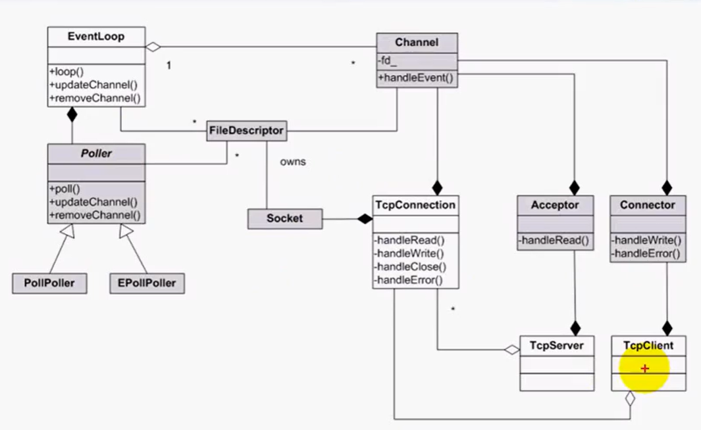

# 集群聊天服务器项目总结
该项目在 Linux 下使用 Vscode 进行项目的开发，通过Cmake构建项目，使用gdb进行项目问题的调试。这个项目分为4个模块，

* 首先，第一个模块是网络模块，通过剖析muduo网络库的核心组件，采用C++11重写muduo库的核心组件，将依赖于boost库的技术点转化为C++11的知识点，使其脱离boost库，实现出一套网络库来使用，使用这个网络库的好处是：解耦了网络模块的代码和业务层的代码，能够让开发者专注于业务层的开发。

* 然后，第二个模块是业务模块，也就是是服务层，该项目使用了C++11的一些技术，比如说，map，绑定器，函数对象，做了一个消息id和这个消息发生以后的回调操作的绑定，相当于是做了一个回调机制，当这个网络I/O给服务器通知有消息请求，服务器处理客户注册的读事件的回调操作(OnMessage)，通过消息请求，从消息里面(buffer)解析出这个json，得到消息id，通过回调操作，就可以处理这个消息了。

* 第三个是数据存储层，该项目使用的是MySQL，对于项目的关键的数据进行存储，比如说，用户的id，离线消息，好友列表，群组列表的关系，都是在MySQL存储。该项目还通过实现一个MySQL数据库连接池，在项目代码上还通过书写model类对业务层封装底层数据库，提高MySQL数据库的访问效率。

* 在单机模式下，主要就是这3个模块，但是单机的并发能力是有限的，所以，考虑项目的整体的并发能力，让项目可以支持多机的扩展，部署多台网络服务器，前面需要挂1个Nginx负载均衡，这个项目是基于TCP的私有协议，自己去搭建的基于C/S模型的通信，所以我通过对Nginx的tcp的负载均衡配置，做一个长连接，因为是消息聊天通信，客户端不仅仅要给服务器主动发消息，而且服务器还要主动给客户端推消息，所以必须是长连接，短连接做不到这个功能，因为短连接没有办法给客户端推消息，另外，在负载均衡里面，因为是各个服务器有不同的人进行注册，不同服务器上注册的用户需要进行通信的话，在该项目引入了Redis作为一个MQ消息队列的功能，利用它的发布订阅功能实现了跨服务器的消息通信功能。

**环境**
  + vscode
  + centos7
  + gcc-10.2.0
  + mysql-8.0.26
  + redis-6.2.6
  + hiredis-1.0.2
  + nginx-1.10.1
  + nlohmann_json-3.2.0


## nlohmann::json
* [github link](https://github.com/nlohmann/json)
该json库很好使用，但遇到的问题是：由于使用最新的该json库，所以gcc-4.8.5(C++11)编译后运行代码会出现bug，建议使用较新的的gcc，或者使用低版本的json库


## CMake
由于使用较新的的gcc编译器，所以在`CMakeLists.txt`最开始时要设置以下路径，不然还是会使用的gcc-4.8.4版本的

```set (CMAKE_C_COMPILER "/usr/local/bin/gcc")```

```set (CMAKE_CXX_COMPILER "/usr/local/bin/g++")```

还需要配置一下编译选项，最好选择C++14。

学习到：项目下新建 `build` 文件夹，进入该目录(`cd ./build`)，后就可以运行cmake：

```cmake ..```

```make```

这样项目就不会显得很乱。


## MySQL
[下载Linux版MySQL安装包](https://downloads.mysql.com/archives/community/)，安装过程：

```mkdir mysql```

```tar -zxvf mysql-8.0.26-1.el7.x86_64.rpm-bundle.tar -C mysql```

```rpm -ivh mysql-community-common-8.0.26-1.el7.x86_64.rpm --nodeps --force```

```rpm -ivh mysql-community-client-plugins-8.0.26-1.el7.x86_64.rpm  --nodeps --force```

```rpm -ivh mysql-community-libs-8.0.26-1.el7.x86_64.rpm  --nodeps --force```

```rpm -ivh mysql-community-libs-compat-8.0.26-1.el7.x86_64.rpm  --nodeps --force```

```yum install openssl-devel```

```rpm -ivh  mysql-community-devel-8.0.26-1.el7.x86_64.rpm  --nodeps --force```

```rpm -ivh mysql-community-client-8.0.26-1.el7.x86_64.rpm  --nodeps --force```

```rpm -ivh  mysql-community-server-8.0.26-1.el7.x86_64.rpm  --nodeps --force```


MySQL服务相关命令

```systemctl start mysqld```

```systemctl restart mysqld```

```systemctl stop mysqld```


还是因为使用的版本较新，所以`/usr/bin`目录下可能没有`mysqlclient`这个动态库，建议先在根目录搜一下该库的位置，然后链接到`/usr/bin`目录下，使用

``` sudo find / -name "*mysqlclient*"```

``` sudo ln -s  /usr/lib64/mysql/libmysqlclient.so /usr/lib/libmysqlclient.so```


mysql配置参考: [CNDS](https://blog.csdn.net/qq_28374489/article/details/123091635)


##### MySQLConnectionPool
可以参考 [苏老师](https://www.bilibili.com/video/BV1Fr4y1s7w4/?spm_id_from=333.1007.top_right_bar_window_default_collection.content.click)的课程，数据库连接池整体就是一个生产者与消费者模型，使用了单例模式。


## nginx
nginx配置tcp负载均衡，nginx编译加入`–with-stream`参数激活tcp负载均衡模块。

下载tar包

```wget http://nginx.org/download/nginx-1.10.1.tar.gz```


安装过程：

```tar -zxvf nginx-1.10.1.tar.gz```

```cd nginx-1.10.1```

```./configure --with-stream```

```make && sudo make install```

```cd /usr/local/nginx/conf```

```sudo vim nginx.conf```


添加以下代码：
``````
stream {
    upstream MyServer{
       # 配置两台服务器分别监听端口6000和60001
       # weight=1，就是权重。配置强的服务器可以给它配置的权重大一些
       # max_fails 是在完成心跳机制，连续超过3次心跳失败，就认为服务器挂掉
       # fail_timeout，等心跳30秒。

       server 127.0.0.1:6000 weight=1 max_fails=3 fail_timeout=30s;
       server 127.0.0.1:6001 weight=1 max_fails=3 fail_timeout=30s;
     }

     server {
     # proxy_timeout 3s;是指nginx只和后端的chatserver连接3秒就断开
     # proxy_connect_timeout的意思是nginx得连接后台的server服务器，第一次连接的时候发现超过1秒的时间还没有握手成功就判定连接失败了
     # tcp_nodelay 就是配置TCP的参数
     # listen 8000是让客户端都往8000端口发送数据，8000端口可以给你负载均衡
     proxy_connect_timeout 1s;
     #proxy_timeout 3s;
     listen 8000;
     proxy_pass MyServer;
     tcp_nodelay on;
   }
}
``````
启动nginx：

```cd /usr/local/nginx/sbin```

```./nginx```


## Redis
[官网下载](https://redis.io/)
安装过程：

```tar -xzf redis-6.2.6.tar.gz```

```cd redis-6.2.6```

```make && sudo make install```


redis配置参考 [BLOG](https://www.cnblogs.com/look-word/p/16593094.html)

该项目中服务器中间件-基于发布-订阅的Redis。集群部署的服务器之间进行通信，最好的方式就是引入中间件消息队列，解耦各个服务器，使整个系统松耦合，提高服务器的响应能力，节省服务器的带宽资源。
* subscribe:表示订阅成功的反馈信息。第二个值是订阅成功的频道名称，第三个是当前客户端订阅的频道数量。
* message:表示接收到的消息，第二个值表示产生消息的频道名称，第三个值是消息的内容。
* unsubscribe:表示成功取消订阅某个频道。第二个值是对应的频道名称，第三个值是当前客户端订阅的频道数量，当此值为0时客户端会退出订阅状态，之后就可以执行其他非"发布/订阅"模式的命令了。

服务端要与redis通信需要用到redis API，这就需要安装hiredis库。


## Hiredis
[下载地址](https://github.com/redis/hiredis/releases)
安装过程：

```tar -xzf hiredis-1.0.2.tar.gz```

```cd hiredis-1.0.2```

```make && sudo make install```


## muduo
该项目最难的就是muduo网络库的刨析与用C++重写。

思想: one loop per thread, 基于对象编程(muduo库只暴露具体类，不暴露抽象类，也不使用虚函数)


##### Class Structure



##### 技术亮点
* EventLoop中使用了eventfd来调用wakeup()，让mainloop唤醒subloop的epoll_wait阻塞
* 在EventLoop中注册回调cb至pendingFunctors_，并在doPendingFunctors中通过swap()的方式，快速换出注册的回调，只在swap()时加锁，减少代码临界区长度，提升效率。（若不通过swap()的方式去处理，而是加锁执行pendingFunctors中的回调，然后解锁，会出现什么问题呢？1. 临界区过大，锁降低了服务器响应效率 2. 若执行的回调中执行queueInLoop需要抢占锁时，会发生死锁）
* Logger可以设置日志等级，调试代码时可以开启DEBUG打印日志；若启动服务器，由于日志会影响服务器性能，可适当关闭DEBUG相关日志输出
* 在Thread中通过C++lambda表达式以及信号量机制保证线程创建时的有序性，只有当线程获取到了其自己的tid后，才算启动线程完毕
* TcpConnection继承自enable_shared_from_this，TcpConnection对象可以调用shared_from_this()方法给其内部回调函数，相当于创建了一个带引用计数的shared_ptr，可参考链接 [link](https://blog.csdn.net/gc348342215/article/details/123215888)，同时muduo通过tie()方式解决了TcpConnection对象生命周期先于Channel结束的情况
* muduo采用Reactor模型和多线程结合的方式，实现了高并发非阻塞网络库


参考[muduo_cpp11](https://github.com/S1mpleBug/muduo_cpp11)
参考[muduo_study](https://github.com/834810071/muduo_study)


# reference
* [施磊老师](https://ke.qq.com/cgi-bin/agency?aid=73602)
* [CNDS-LINZEYU666](https://blog.csdn.net/LINZEYU666?type=blog)
